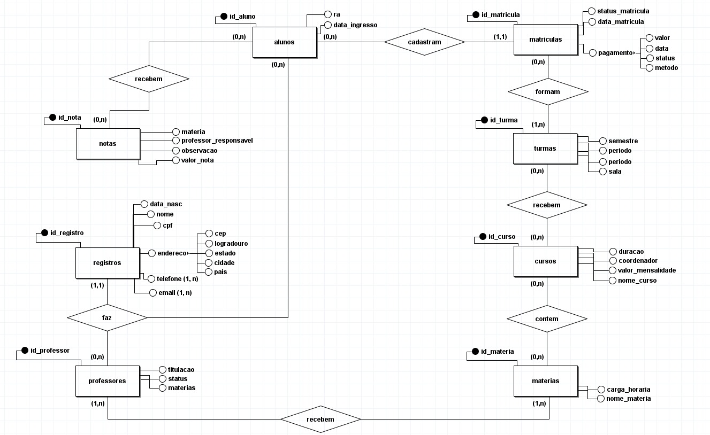
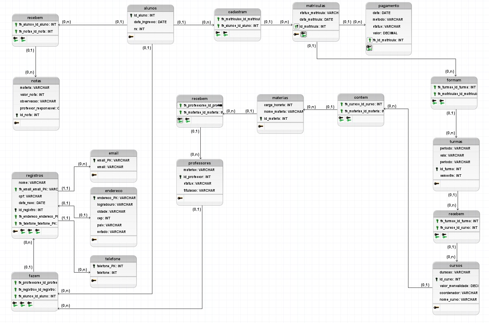

# UNIFECAF_SQL_FACULDADE

# Análise de Requisitos para Sistema de Gestão Acadêmica

Este questionário foi elaborado para entender as necessidades dos clientes e os requisitos do sistema de gestão acadêmica. Ele abrange as principais funcionalidades, tipos de dados e relacionamentos necessários para o funcionamento do sistema.

## 1. Quais são as principais necessidades dos clientes?

**R:** Os clientes precisam de um sistema para armazenar informações sobre alunos, professores, cursos, matérias, turmas, matrículas, notas e pagamentos, com o objetivo de gerenciar melhor a organização acadêmica, acompanhar o desempenho dos alunos e administrar os cursos oferecidos.

### a. Quais informações precisam ser armazenadas?

**R:** É necessário armazenar informações detalhadas sobre:

- **Alunos:** Nome, CPF, data de nascimento, data de ingresso, RA, e histórico acadêmico.
- **Professores:** Nome, titulação, status, disciplinas lecionadas e turmas associadas.
- **Cursos:** Nome, duração, valor da mensalidade, coordenador, matérias associadas e turmas vinculadas.
- **Matérias:** Nome, carga horária e professores responsáveis.
- **Notas:** Valores, matérias relacionadas, professores responsáveis e observações.
- **Turmas:** Período, sala, semestre e curso associado.
- **Matrículas:** Data de matrícula e status.
- **Pagamentos:** Data, valor, método e status.

### b. Quais os dados precisam ser guardados?

**R:** Devem ser armazenados dados pessoais (como nome e CPF), dados acadêmicos (como notas, matérias e histórico escolar), e dados administrativos (como pagamentos e matrículas).

### c. O que será feito com os dados posteriormente?

**R:** Os dados serão utilizados para:

- Gerar relatórios sobre desempenho acadêmico, frequência e inadimplência.
- Monitorar a situação das turmas e a alocação de professores.
- Auxiliar na tomada de decisões administrativas e acadêmicas.

## 2. Quais tabelas precisam ser criadas para que todas as informações sejam armazenadas?

**R:** As tabelas que precisam ser criadas são:

- notas
- alunos
- matérias
- registros
- professores
- cursos
- matrículas
- turmas
- email
- endereço
- telefone
- pagamento

Tabelas intermediárias para relacionamentos:

- recebem_alunos
- cadastram
- formam
- recebem_turmas
- contem
- fazem
- recebem_professores

## 3. Quais atributos cada tabela deve ter?

**R:** Com base no código fornecido:

- **notas:** matéria, valor_nota, observacao, professor_responsavel, id_nota (chave primária).
- **alunos:** id_aluno (chave primária), data_ingresso, ra.
- **materias:** carga_horaria, nome_materia, id_materia (chave primária).
- **registros:** nome, fk_email_email_PK, cpf, data_nasc, id_registro (chave primária), fk_endereco_endereco_PK, fk_telefone_telefone_PK.
- **professores:** materias, id_professor (chave primária), status, titulacao.
- **cursos:** duracao, id_curso (chave primária), valor_mensalidade, coordenador, nome_curso.
- **matriculas:** status_matricula, data_matricula, id_matricula (chave primária).
- **turmas:** periodo, sala, id_turma (chave primária), semestre.
- **email:** email_PK (chave primária), email.
- **endereco:** endereco_PK (chave primária), logradouro, cidade, cep, pais, estado.
- **telefone:** telefone_PK (chave primária), telefone.
- **pagamento:** data, metodo, status, valor, fk_id_matricula (chave estrangeira para matriculas).

## 4. Qual o tipo de dados de cada atributo definido?

**R:** Com base no código:

- **VARCHAR:** Strings como nomes, e-mails e endereços.
- **CHAR:** Dados com tamanho fixo, como CPF e CEP.
- **INT:** Identificadores e números inteiros.
- **DECIMAL:** Valores monetários, como mensalidades e pagamentos.
- **DATE:** Datas como nascimento, ingresso, matrícula e pagamentos.

## 5. Quais são os relacionamentos a serem criados entre as tabelas?

**R:** Os relacionamentos necessários incluem:

- Notas vinculadas a alunos e matérias.
- Alunos associados a matrículas, turmas e pagamentos.
- Professores relacionados a matérias e turmas.
- Cursos compostos por várias matérias e vinculados a turmas.
- Registros relacionados a email, endereço e telefone.
- Tabelas intermediárias para gerenciar associações complexas, como recebe_alunos, cadastram, formam, recebem_turmas, contem, fazem e recebem_professores.

# **Modelo Conceitual.**

O modelo conceitual de banco de dados é uma visão geral e abstrata do sistema, que descreve as entidades principais e como elas se relacionam, sem entrar em detalhes técnicos. Ele foca no que é importante para o negócio, como, por exemplo, alunos, cursos e professores, e como essas entidades interagem. O objetivo é entender as necessidades do sistema antes de construir a estrutura do banco de dados.

# **Modelo Lógico.**

O modelo lógico de banco de dados é um planejamento de como as informações serão organizadas e relacionadas dentro do sistema. Ele define o que será armazenado (como alunos, cursos, notas) e como essas informações se conectam entre si.

# **Modelo Fisico.**

O modelo físico de banco de dados é a implementação real do banco, onde são definidos os detalhes técnicos como tabelas, tipos de dados, chaves, índices e outras otimizações para garantir o armazenamento eficiente e o bom desempenho das consultas. Ele é construído a partir do modelo lógico, transformando-o em um código SQL executável.

[Modelo Físico da Faculdade](MODELO_FISICO_FACULDADE.sql)
